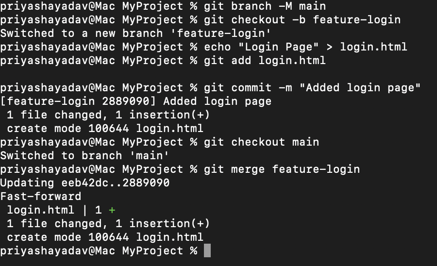
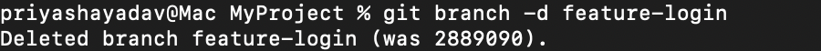

# Task 1

## Part 1: Introduction to Version Control and Git
### Task 1: Install and Configure Git

1. Configure Git with your username and email:
    ```
    git config --global user.name "Priyasha-Yadav"
    git config --global user.email "priyasha.yadav.cg@gmail.com"
    ```

<i>git config: This is used to configure Git settings or connect git to your local system.

It includes --global: For global configuration. i.e, for all repositories on the system.
and --local: to set it only for a specific repository.

user.name: Sets name that will be associated with commits (github username).
user.email: Sets your email address that will be associated with commits(github email).</i>

2. View your Git configuration:

    ```
    git config -list
    ```
<i>This command lists all the Git configuration settings including set-ups </i>


### Task 2: Initialize a Repository 
1. Create a new project folder and navigate to it:
   ```
   mkdir MyProject
   cd MyProject
   ```
<i>mkdir creates a new directory named MyProject and cd changes the directory to MyProject</i>

2. Initialize it as a Git repository:
    ```
    git init
    ```

<i>git init, Initializes a new Git repository.</i>
### Task 3: Create a File and Make Multiple Commits
1. Create a new file and add content:

<i>Creates a file named README.md</i>
```
echo "My First Project" > README.md
```
echo > file.txt ⁠:
- Overwrites the file contents.
- Creates a new file if it doesn't exist.
- Only writes the current echo output to the file.

echo >> file.txt ⁠:
- Appends to the existing file contents.
- Creates a new file if it doesn't exist.
- Adds the current echo output to the end of the file.

2. Stage the file:
```
git add README.md
```
3. Commit the file:

```
git commit -m "Initial commit: Added README.md"
```
4. Make changes to the file:
```
echo "Added a description" >> README.md
```

5. Stage and commit the changes:
```
git add README.md
git commit -m "Updated README with a description"
```


### Task 4: Check Status and Log
1. Check the repository’s current status:
```
git status
```
<i>

 - On branch main: You are currently on the main branch.


- Your branch is up to date with 'origin/main': Your local main branch is up to date with the remote origin/main branch (i.e., no new changes on the remote).

- Changes to be committed: These are the files that have been staged and are ready to be committed (e.g., README.md and index.html).

- Changes not staged for commit: Files that have been modified but not staged. These need to be added with git add if you want them to be included in the next commit (e.g., README.md is modified but not yet staged).

- Untracked files: Files that Git is not tracking yet, such as temp.md. You can use git add to start tracking these files.
</i>

2. View commit history in detail:
```
git log --oneline --graph --decorate
```
<i>

- A shortened commit hash and commit message (--oneline).

- A visual representation of the branch structure (--graph).

- The current branches and tags associated with each commit (--decorate).

</i>


### Task 5: Create and Clone a Repository

1. Create a repository on GitHub named example-repo.
2. Clone it locally:

```
git clone https://github.com/Priyasha-Yadav/example-repo
```
<i> Clones the repository into your system</i>


### Task 6: Understanding the Git Workflow
<ul>
<li>Example Workflow:
<ol>
<li>Make changes to a file in the working directory:

```
echo "Workflow example" > workflow.md
```
</li>
<li>Stage the file:

```
git add workflow.md
```
</li>
<li>
Commit the file to the repository:

```
git commit -m "Added workflow example"
```

</li>


- _The git add command is used to stage changes, i.e., to prepare your modifications (new files, modified files, or deleted files) to be included in the next commit._

- _The git commit command is used to save the staged changes to the repository’s history and make it part of the repository’s commit history._


</ul>

## Part 2: Working with Repositories

### Task 7: Branching and Merging

1. Create a new branch for a feature:
```
git branch feature-login
git checkout feature-login
```
_To create a new branch and then switch to it_

Or use:
```
git checkout -b feature-login
```
2. Add a new file and commit changes:
```
echo "Login Page" > login.html
git add login.html
git commit -m "Added login page"
```

3. Merge the feature branch into main:
```
git checkout main
git merge feature-login
```



### Task 8: Handling Merge Conflicts

1. Create two branches:
```
git branch branch-A
git branch branch-B
```

2. Modify the same line in `README.md` in both branches.

3. Merge `branch-A` into `main`:
```
git checkout main
git merge branch-A
```

4. Attempt to merge branch-B into main (this will cause a conflict):
```
git merge branch-B
```

5. Resolve the conflict manually in README.md, then:
```
git add README.md
git commit -m "Resolved merge conflict between branch-A and branch-B"
```


### Task 9: Renaming and Deleting Branches

1. Rename a branch:
```
git branch -m old-branch-name new-branch-name
```



2. Delete a branch:

```
git branch -d feature-login
```


## Part 3: Advanced Git Operations

### Task 10: Using Git Stash

1. Make changes to a file but don’t commit:
```
echo "Temporary work" >> temp.md
```
2. Stash the changes:
```
git stash
```
3. View stashed changes:
```
git stash list
```
4. Apply the stashed changes:
```
git stash apply
```
5. Drop the stash after applying:
```
git stash drop
```


### Task 11: Rewriting History with Interactive Rebase
1. Create multiple commits:
```
echo "Commit 1" > file1.txt && git add file1.txt && git commit -m "Commit 1"
echo "Commit 2" > file2.txt && git add file2.txt && git commit -m "Commit 2"
echo "Commit 3" > file3.txt && git add file3.txt && git commit -m "Commit 3"
```


2. Squash commits into one:
```
git rebase -i HEAD~3
```


### Task 12: Cherry-Picking Commits

1. Create a new branch:
```
git checkout -b cherry-pick-example
```

2. Cherry-pick a specific commit from another branch:
```
git cherry-pick <commit-hash>
```

### Task 13: Tagging Commits

1. Tag the current commit:
```
git tag -a v1.0 -m "Version 1.0 release"
```
2. Push the tag to the remote repository:
```
git push origin v1.0
```


### Task 14: Working with Remote Repositories

1. Add a remote repository:
```
git remote add origin <repository-url>
```
2. Push your changes to the remote repository:

```
git remote add origin https://github.com/Priyasha-Yadav/example-repo.git
git push -u origin main
```


### Task 15: Forking and Contributing

1. Fork a repository on GitHub.

2. Clone the fork locally:
```
git clone https://github.com/Priyasha-Yadav/Apple
```
3. Create a new branch, make changes, and push:
```
git checkout -b fix-typo
echo "Typo fixed" >> README.md
git add README.md
git commit -m "Fixed a typo"
git push origin fix-typo
Open a pull request on GitHub.
```

example-repo.git

## Part 4: Additional Practice

### Task 16: Simulate Team Collaboration

1. Create a repository and share it with a friend.
2. Both make changes to the same file simultaneously.
3. Practice resolving merge conflicts and pushing changes.

### Task 17: Git Ignore

1. Create a .gitignore file:
```
echo "node_modules/" > .gitignore
```
2. Add files and ensure ignored files are not staged:

```
git add .
```