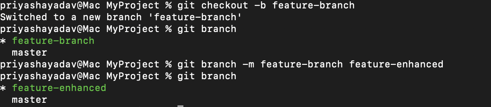

# Task 2
## Part 1: Git Basics
### Task 1: Install and Configure Git
1. Install Git from git-scm.com.
2. Configure your global Git settings:
```
git config --global user.name "Priyasha-Yadav"
git config --global user.email "priyasha.yadav.cg@gmail.com"
```
<i>

- System level: Configuration applies to all users on the system. These settings are typically found in the global Git configuration file located at /etc/gitconfig (or equivalent, depending on your OS).

- Global level: Configuration applies to the current user and affects all repositories that the user interacts with. The file for global settings is typically ~/.gitconfig or ~/.config/git/config (in your home directory).

- Local level: Configuration applies only to a specific repository. These settings are stored in the .git/config file inside the repository itself.
</i>

```bash
git config --global core.editor "vim/code/nano"
```
<i>This sets your default editor for commit messages, rebase, and merge messages.</i>

3. Verify the configuration:
```bash
git config --list
```
<i>
This will display all configuration settings (global, local, or system) that are active at the moment.
</i>


### Task 2: Initialize a Repository

1. Create a directory and initialize it as a Git repository:
```bash
mkdir MyProject
cd MyProject
git init
```


## Part 2: Basic Workflow

### Task 3: Creating and Committing Files

1. Create a file:
```bash
echo "Hello Git" > file1.txt
```
2. Stage and commit the file:
```bash
git add file1.txt
git commit -m "Initial commit: Added file1.txt"
```
### Task 4: Viewing Changes

1. Modify the file:
```bash
echo "Git is awesome!" >> file1.txt
```
2. Check file status and differences:
```bash
git status
git diff
```


## Part 3: Branching and Merging

### Task 6: Branch Management

1. Create a branch and switch to it:
```
git checkout -b feature-branch
```

2. List branches:
```
git branch
```
3. Rename a branch:
```
git branch -m feature-branch feature-enhanced
```


### Task 7: Merging Branches

1. Merge feature-enhanced into main:
```
git checkout main
git merge feature-enhanced
```

### Task 8: Handling Merge Conflicts
1. Create two conflicting branches and resolve a conflict manually:
```bash
git merge <branch-name>
```
2. Use:
```
git add <resolved-file>
git commit
```
## Part 4: Remote Repositories

### Task 9: Remote Setup

1. Add a remote repository:
```
git remote add origin https://github.com/your-username/repo.git
```

2. Verify the remote:
```
git remote -v
```

### Task 10: Push and Pull

1. Push changes to the remote repository:
```
git push -u origin main
```
2. Pull changes from the remote:
```
git pull origin main
```
### Task 11: Cloning a Repository

1. Clone a remote repository:
```
git clone https://github.com/your-username/repo.git
```
## Part 5: Advanced Git

### Task 12: Stashing Changes

1. Save uncommitted changes:
```
git stash
```
2. Apply stashed changes:
```
git stash apply
```

3. Drop the stash:
```
git stash drop
```

### Task 13: Tagging Commits

1. Create and annotate a tag:
```
git tag -a v1.0 -m "Version 1.0 release"
```

2. Push the tag to the remote:
```
git push origin v1.0
```

### Task 14: Rewriting Commit History

1. Use interactive rebase to modify commit messages:
```
git rebase -i HEAD~3
```

Replace pick with edit or squash as needed.
### Task 15: Cherry-Picking Commits

Apply a specific commit to another branch:
```
git cherry-pick <commit-hash>
```

## Part 6: Collaboration

### Task 16: Forking and Pull Requests

1. Fork a repository and clone it locally:
```
git clone https://github.com/your-username/forked-repo.git
```

2. Make changes and push them:
```
git checkout -b fix-typo
echo "Typo fixed" >> README.md
git commit -m "Fixed a typo"
git push origin fix-typo
```
3. Open a pull request on GitHub.

### Task 17: Simulating Team Collaboration

1. Simulate a conflict by having two users modify the same file.

2. Practice resolving the conflict as a team.

## Part 7: Ignoring Files

### Task 18: Using .gitignore

1. Create a .gitignore file:
```
echo "node_modules/" > .gitignore
git add .gitignore
git commit -m "Added .gitignore"
```

2. Verify that ignored files are not staged:
```
git status
```
## Part 8: Automation and Cleanup

### Task 19: Cleaning the Repository

1. Remove untracked files:
```
git clean -f
```

### Task 20: Aliases and Shortcuts

1. Create an alias for frequently used commands:
```
git config --global alias.st status
git config --global alias.cm commit
```

2. Use the alias:
```
git st
git cm -m "Message"
```